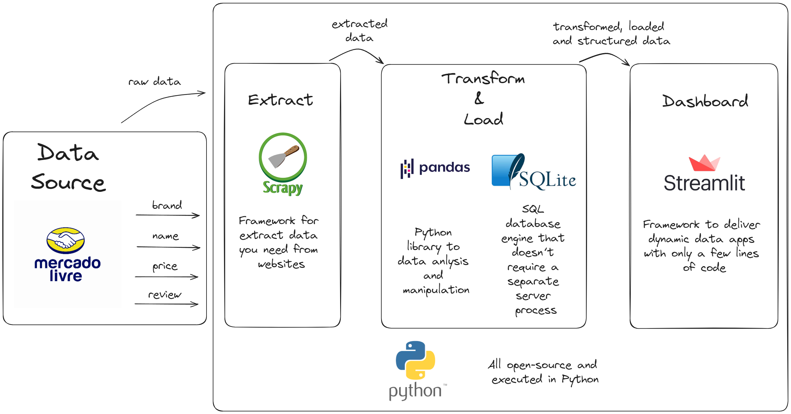

# Web Scraping with Python

## Project Overview

This project simulates a real-world need for a large shoe company looking to analyze sales of shoe market on [Mercado Livre](https://lista.mercadolivre.com.br/tenis-corrida-masculino) and prepear a competitive pricing strategy.

**Objectives of the company:**

- Identify the most prevalent brands across the first 20 pages of search results.
- Calculate the average price of sports shoes for each brand.
- Determine the average customer satisfaction (based on reviews) for each brand.

We'll achive this using a robust **ETL (Extract, Transform, and Load) pipeline** built with Python and popular open-source libraries:

- *Extraction:* scrape product data from Mercado Livre using the `Scrapy` web scraping framework.
- *Transformation:* clean and structure the raw data using `pandas` DataFrames.
- *Loading:* store the processed data in a local `SQLite3` database.
- *Visualization:* create an interactive dashboard using `Streamlit` to present insights.

**Libraries used:**
```bash
pip install scrapy pandas sqlite3 streamlit
```

## 1. Data Extraction with Scrapy

**1.1. Project Setup**

- Generate a Scrapy project with directory and files:
```bash
scrapy startproject collect
```
> `collect` is the directory name and can be replaced for whathever you want to.

- Navigate to the project directory and generate `spider` to run the scraping:
```bash
cd collect
```
```bash
scrapy genspider mercadolivre https://lista.mercadolivre.com.br/tenis-corrida-masculino
```
> replace `mercadolivre` for the name you want and `https://lista.mercadolivre.com.br/tenis-corrida-masculino` for the url site you want to extract information.

The `spider` will do the request (access the url), do the parse (collect the information you want for project) to put in a database, and do the next_page (search in multiple pages of url).

**1.2. Scrapy Configuration (`settings.py`)**

To access information from url, you need to configure your user agent:
```python
USER_AGENT = ['your_user_agent']
```
>The user agent can be found in a search site tapping "my user agent".

To navigate and collect for all desired pages we want in the url, we need to deactivate de robottext security:
```python
ROBOTSTXT_OBEY = False
```

> Other configurations can be explored in the [Scrapy documentation](https://docs.scrapy.org/en/latest/).

**1.3. Testing Spider in Terminal**

With `scrapy` you can run test of commands in the terminal using:
```bash
scrapy shell
```

The command
```bash
fetch('https://lista.mercadolivre.com.br/tenis-corrida-masculino')
```
will request text information of the html from the site you want, in this case the https://lista.mercadolivre.com.br/tenis-corrida-masculino.


Needed to parse the html:
- Recovering the block of html with the information for analysis
```bash
response.css('div.ui-search-result__content')
```

- Getting the number of itens recovered inside the html block
```bash
len(response.css('div.ui-search-result__content'))
```

- Generate a variable `products` with the response of the block intended to course the each item and extract each information intended.
```bash
products = response.css('div.ui-search-result__content')
```

- Getting each information from the html block
```bash
products.css('ui-search-item__brand-discoverability ui-search-item__group__element::text').get()
```

- Get out of the `scrapy shell`:
```bash
exit()
```

> This step (1.3) can be passed directly to the **1.4. Spider Code**. Although, running first on terminal facilitates the execution and experimentation of the commands to include on the script, without the need to run the script every time we want to test the commands.

**1.4. Spider Code (`mercadolivre.py`)**

After the tests in terminal, generate the script to performate the request to the site and scrap each one of the desired itens like inside `def parse` of the `mercadolivre.py`.

**1.5. Running Spider**

Execute the spider to scrape data and save it to a JSON Lines file:
```bash
scrapy crawl mercadolivre -o data.jsonl
```

## 2. Data transformation and loading with pandas and SQLite

We'll use the `main.py` inside `transformation` directory to handle data transformation and loading.

First, we read the `data.jsonl` file generated in previous step with `pandas`.

We'll include two collumns on the table:
- The first has the source of the information we scraped (`[_source]`);
- And the second will inform the date and time we did the extraction (`[_collect_date]`), using the function 
```python
datetime.now()
```

The process of transformation of data consisted in handle missing values (converting *NULL* to *0*), convert data types (string to numeric), and combine the reais and cents values in the columns prices.

After the transformation, we establ9ish a connection to database (`quotes.db`) using the SQLite3 and save the data in a table (mercadolivre_itens) inside the database. SQLite has an architecture that runs on the client (our computer), different from the usual server-client, which exempts us from creating a server.

Now we can run our transformation and load:
```bash
python transformation/main.py
```

## 3. Building the Dashboard with Streamlit

We'll design the dashboard layout script in app.py. First, we connect to our database created in the previous step and execute a query to recover all extracted data.

After this, we organize our streamlit dashboard in the way wanted.
Here, I created 3 KPIs (Key Performance Indicators) with important information for the client on sport shoes market.
The KPIs are:
- Total number of itens;
- Number of unique brands;
- Average of price (new price).

To finalize, we constructed charts and tables to answer the questions for achive company objectives:
- Which brands are mostly found until the last page?
- Which is the average price by brand?
- Which is the satisfaction by brand?

Now, we run the script with the streamlit application in terminal to visualize the dashboard.
```bash
streamlit run dashboard/app.py
```
---------------------------------------------------------------------
**OBS**: all commands for
1. extraction:
```bash
scrapy crawl mercadolivre -o data.jsonl
```
2. transformation and load:
```bash
python transformation/main.py
```
3. dashboard creation:
```bash
streamlit run dashboard/app.py
```
need to be run inside the `src` folder.

## Final comments

Here is a complete project from beginning to end, with ETL of data, analysis and creating of dashboard to data view. This project was completely executed with open-source tools and using Python.


